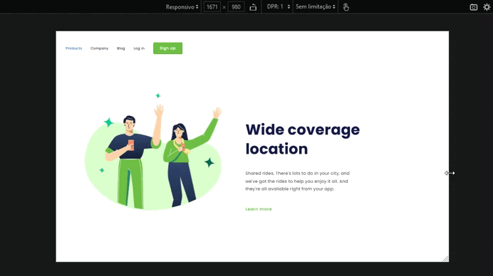
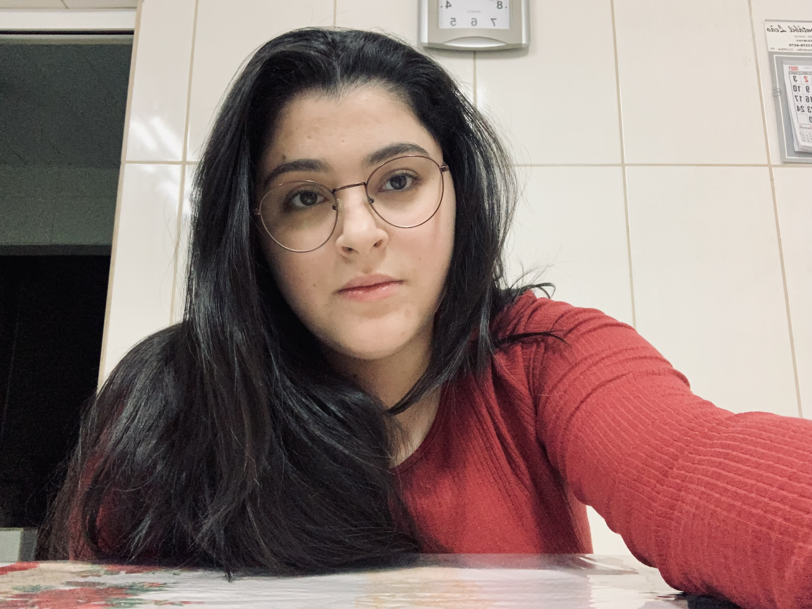

# Wide Coverage Location

> A interface foi desenvolvida com o objetivo voltado ao aprendizado de HTML, CSS e responsividade. Quando a interface atinge uma largura máxima de 600px o menu principal desaparece e o texto inverte de posição com a imagem.

### 🚀 Tecnologias

O projeto foi desenvolvido com as seguintes tecnologias:

- HTML
- CSS

## 🤝 Colaboradores

Agradecemos às seguintes pessoas que contribuíram para este projeto:

<table>
  <tr>
    <td align="center">
      <a href="#">
         
        
          <b>Amanda Saporiti</b>
        
      </a>
    </td>
  </tr>
</table>

[⬆ Voltar ao topo](#wide-coverage-location) 
